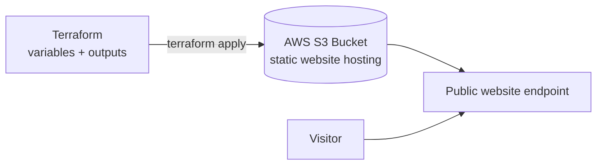

# Terraform AWS Static Website — Infrastructure as Code

A static website hosted on **Amazon S3**, provisioned entirely through **Terraform**. No clicking around the AWS console — one `terraform apply` builds the whole thing, and one `terraform destroy` removes it.

> **Why this project:** to show I can manage real cloud infrastructure declaratively, handle Terraform state, and recover from drift — the core of an Infrastructure-as-Code / cloud support workflow.

---

## Architecture



## Tech stack

| Area | Tools |
|------|-------|
| Cloud | AWS S3 (static website hosting) |
| IaC | Terraform (variables, outputs, state) |

## What it does

- Creates an S3 bucket and configures static-website hosting **as code**.
- Uses **variables and outputs** so the config is reusable, not hard-coded.
- Manages the full Terraform lifecycle: `init → plan → apply → state list → output → destroy`.
- Demonstrates recovering from **infrastructure drift** after resources are changed outside Terraform.

## Run it

```bash
terraform init
terraform plan
terraform apply        # outputs the live website URL
terraform output        # show the endpoint
terraform destroy       # tear everything down
```

## Live demo

🔗 **Live site:** _add your S3 website endpoint here after `terraform apply`_

## What I learned / what it proves

- Treating infrastructure as versioned, repeatable code instead of manual console steps.
- Managing Terraform **state** and reconciling **drift** — a common real-world cloud support task.
- Writing clear setup/teardown docs so anyone can reproduce the environment.
